

  

  

  

 

---

## 👨‍💻 About Me

I'm **Kaarthic Raja** — an engineer who builds systems that *automate themselves*. My profile is powered by **KAARTHIC OS** — a personal operating system identity built with modular SVGs and GitHub Actions.

- ☁️ Cloud architecture on **AWS & Azure**
- ⚙️ **CI/CD pipelines** — Docker, Kubernetes & Terraform
- 📱 Cross-platform apps with **Flutter**
- 🤖 **AI automation** with Python & LLM pipelines
- 🐧 Daily-driving **Linux** and living in the terminal

> *"I don't just write code — I build operating systems for my workflow."*

 

  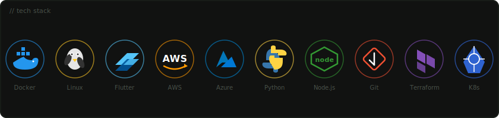

---

## 💻 Animated Terminal

  

---

## 📡 System Dashboard

  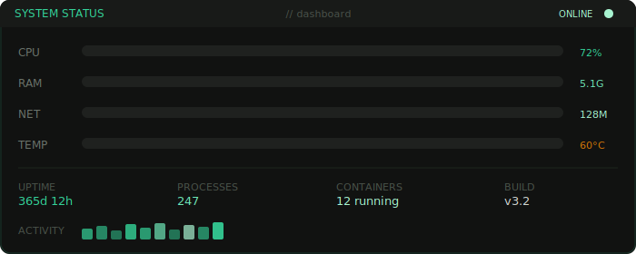

  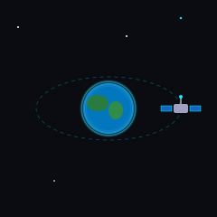
  &nbsp;&nbsp;
  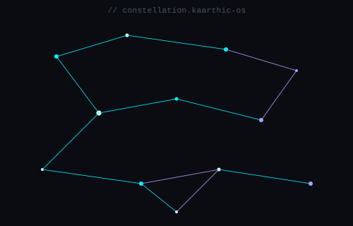
  &nbsp;&nbsp;
  

---

## 🚀 Current Projects

  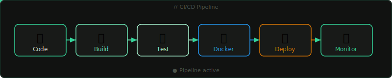

 

  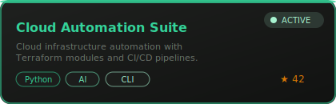
  &nbsp;
  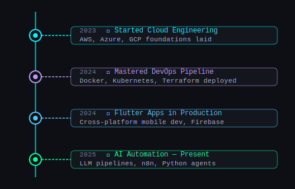

 

  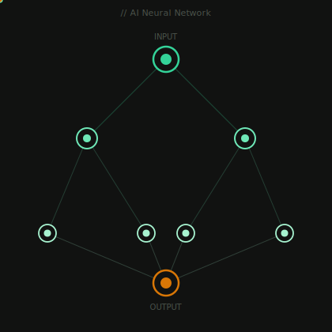
  &nbsp;
  
  &nbsp;
  

---

## 📊 GitHub Stats

  
  &nbsp;
  

## 🌐 Top Languages

  

---

## 📈 Contribution Graph

  

---

## 🐍 Contribution Snake

  <picture>
    <source media="(prefers-color-scheme: dark)"  srcset="assets/generated/github-contribution-grid-snake-dark.svg">
    <source media="(prefers-color-scheme: light)" srcset="assets/generated/github-contribution-grid-snake.svg">
    
  </picture>

---

## 💬 Daily Quote

  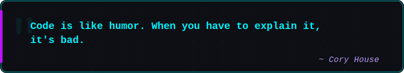

  🤖 Auto-updated every 24h by <code>quote.yml</code> GitHub Action

---

## 👁️ Visitor Counter

&nbsp;

&nbsp;

---

## 🤝 Connect With Me

  

 

---

  

