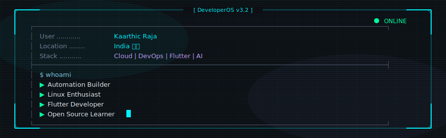

  

 

  

 

---

## 👨‍💻 About Me

Hey there! I'm **Kaarthic Raja** — an engineer who builds systems that *automate themselves*.

- ☁️ Designing cloud infrastructure on **AWS & Azure**
- ⚙️ Building **CI/CD pipelines** with Docker, Kubernetes & Terraform
- 📱 Shipping cross-platform apps with **Flutter**
- 🤖 Exploring **AI automation** with Python & LLM pipelines
- 🐧 Daily-driving **Linux** and living in the terminal

> *"I don't just write code — I build operating systems for my workflow."*

 

---

## ⚡ Tech Stack

     &nbsp;
      &nbsp;
 &nbsp;
  &nbsp;
        &nbsp;
      &nbsp;
    &nbsp;
     &nbsp;
     &nbsp;

 

  

---

## 🚀 Current Projects

  

 

  
  &nbsp;
  

 

   &nbsp;
      &nbsp;
  

---

## 📊 GitHub Stats

  
  &nbsp;
  

## 🌐 Top Languages

  

---

## 📈 Contribution Graph

  

---

## 🐍 Contribution Snake

  <picture>
    <source media="(prefers-color-scheme: dark)"  srcset="assets/generated/github-contribution-grid-snake-dark.svg">
    <source media="(prefers-color-scheme: light)" srcset="assets/generated/github-contribution-grid-snake.svg">
    
  </picture>

---

## 💬 Daily Programming Quote

  

*🤖 Auto-updated every 24 hours by GitHub Actions*

---

## 👁️ Visitor Counter

  
  &nbsp;
  
  &nbsp;
  

---

## 🤝 Connect With Me

  

 

---

  
   
  ⚡ Built with ❤️ and automated by <strong>GitHub Actions</strong> • MIT License

