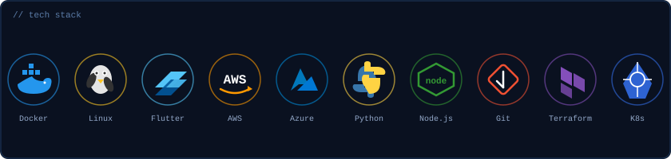
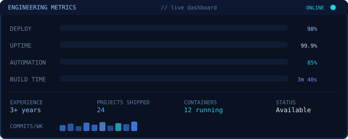
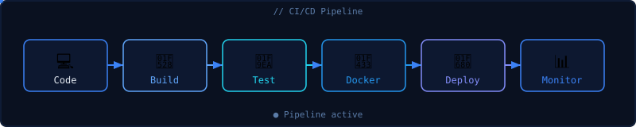
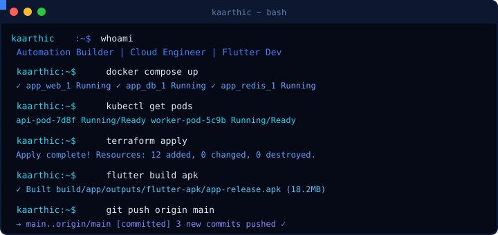
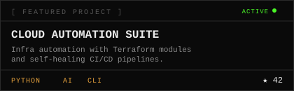
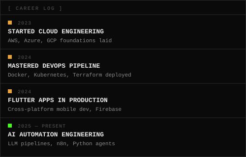
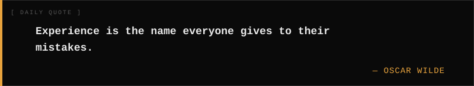
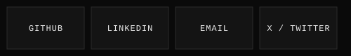

  

  

  

 

---

## About Me

I'm **Kaarthic Raja**, a Cloud & DevOps Engineer who designs infrastructure that runs itself. I build automated cloud platforms, CI/CD pipelines, and cross-platform apps — this profile is one example, an animated portfolio generated entirely by its own GitHub Actions workflows.

- ☁️ Cloud architecture on **AWS** and **Azure**
- ⚙️ **CI/CD automation** — Docker, Kubernetes, Terraform
- 📱 Cross-platform apps with **Flutter**
- 🤖 **AI-driven automation** with Python and LLM pipelines
- 🐧 Linux-first workflow, comfortable end-to-end in the terminal

> *Automate everything. Ship fast. Stay curious.*

 

---

## Tech Stack

  

---

## Live Dashboard

  

---

## How I Ship — CI/CD in Action

  

---

## Terminal

  

---

## Featured Project &amp; Career Timeline

  
  &nbsp;
  

---

## GitHub Stats &amp; Metrics

  

 

  

---

## Contribution Graph

  

---

## Contribution Snake

  <picture>
    <source media="(prefers-color-scheme: dark)"  srcset="assets/generated/github-contribution-grid-snake-dark.svg">
    <source media="(prefers-color-scheme: light)" srcset="assets/generated/github-contribution-grid-snake.svg">
    
  </picture>

---

## Daily Quote

  

  Auto-updated every 24h by <code>quote.yml</code>

---

&nbsp;

&nbsp;

---

## Let's Connect

  

 

---

  

